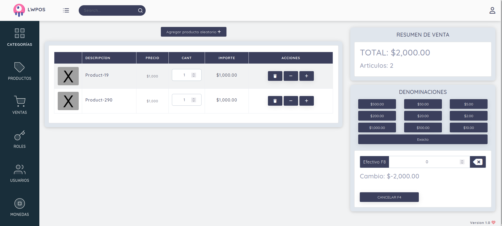
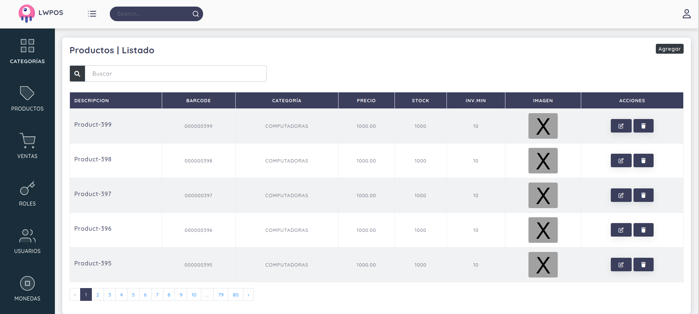

# Tutorial Laravel 9 y Livewire - Simple sales system

https://www.udemy.com/course/sistema-de-ventas-laravel-8-y-livewire

## Concepts seen in the tutorial 
* PHP
* Laravel
* Livewire
* Composer

## Notes
* I used Docker.
* I used Laravel 9.
* In Sales view, added a button for add random product to sale (for testing sales module).
* The permissions module was not implemented, no one should be able to remove, edit or add permissions.
* The assignment module was replaced by a multiple select in the roles form.
* The field profile in users, has been removed because is not used.
* The report type field in reports, has been removed because is not used.
* C# app for printing was not implemented.

# App
Simple sales system

# Composer packages used
* darryldecode/cart
* spatie/laravel-permission
* barryvdh/laravel-dompdf
* maatwebsite/excel

# Deployment

First you have to download the repository 

    git clone https://github.com/demiancy/tutorial-laravel-1.git

Setting environment variables for Laravel in app/.env file, you can use app/.env.example file as an example. 

Use composer for install dependencies

    docker-compose run app composer install

You must prepare your database (which must be previously created and emptied), for this you must first run the migrations and then load the test data: 

    docker-compose run app php artisan migrate:fresh
    docker-compose run app php artisan db:seed

With the next command you start the app in the port 3000 and phpmyadmin in port 80

    docker-compose up

In case of not have Docker, you can run the app into your server.

# Screenshots

